import CustomDetails from "@site/src/components/CustomDetails";
import Tabs from '@theme/Tabs';
import TabItem from '@theme/TabItem';

# Change Operation State

Update the state/status of operations (completed, on hold, etc...).

## Flow Diagram

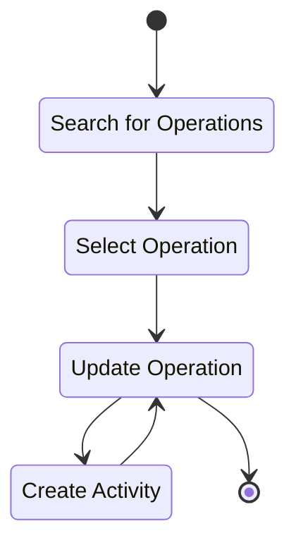

## Screens

### Filter Selection

On this screen you can select the type of filter you want to use to find the operation you need to update.

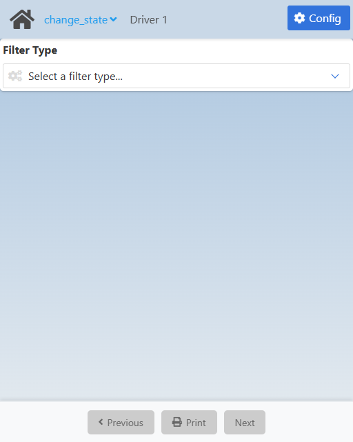

Use the **Filter Type** field to select they way you want to search for operations. 

You can search by:

1. Operation barcode.
2. Work order number.
3. Resource linked to the operation.
4. Operation state:
   - **In Process:** The operation is ongoing; materials are being selected and reserved.
   - **On Hold:** The process is stopped due to a problem, preventing it from continuing until it is resolved.
   - **Complete:** The operation has been completed and the materials have been transferred to production, closing the operation.
   - **Partial Complete:** Although some parts are missing, the process can continue partially, allowing the next step without closing the operation.
5. Work order priority:
   - Critical.
   - High.
   - Standard.
   - Low.
6. Operation description.

Once you select one, you will be taken to the [List of Operations](./change_state.md#list-of-operations) screen.

### List of Operations

On this screen you can see the list of operations that match the filter and the query you used.

<Tabs>
  <TabItem value="barcode" label="Barcode" default>
    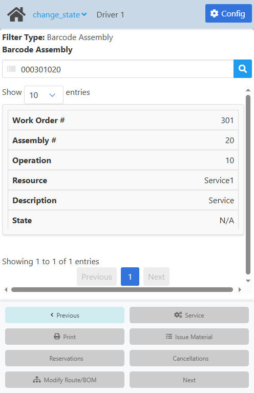
  </TabItem>
  <TabItem value="wo" label="WO">
    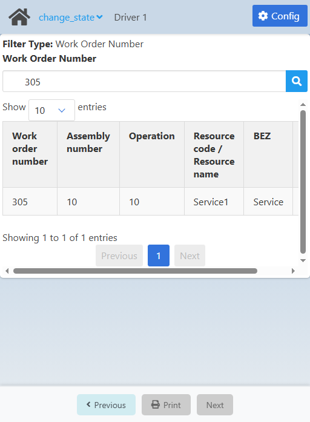
  </TabItem>
  <TabItem value="resource" label="Resource">
    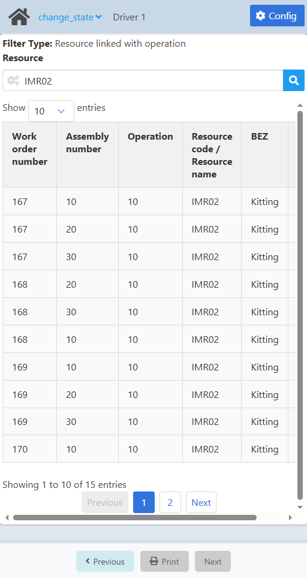
  </TabItem>
  <TabItem value="state" label="State">
    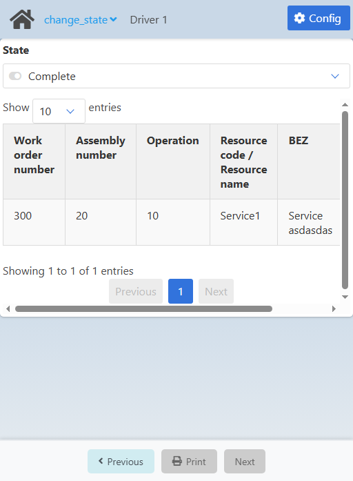
  </TabItem>
  <TabItem value="priority" label="Priority">
    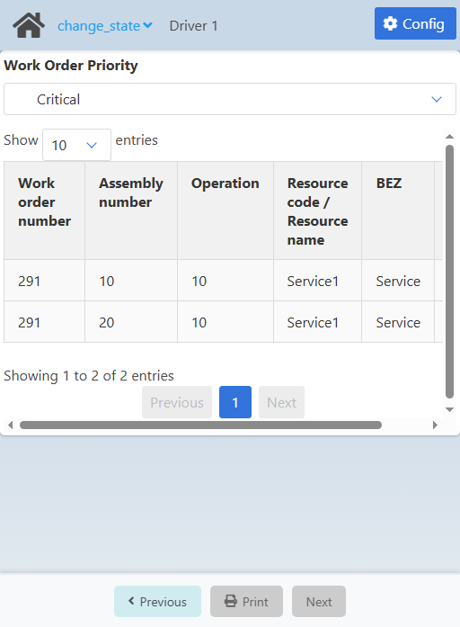
  </TabItem>
  <TabItem value="instruction" label="Instruction">
    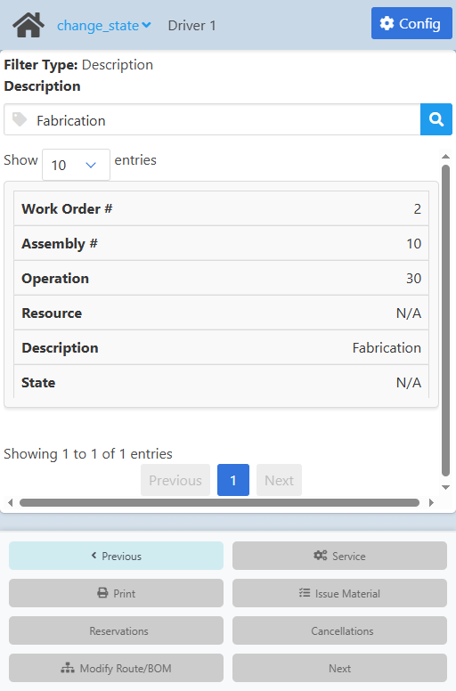
  </TabItem>
</Tabs>

<CustomDetails summary="Table Reference">
  | Column | Description |
  | --- | --- |
  | Work Order # | Work order. |
  | Assembly # | Work order position/assembly. |
  | Operation | Operation. |
  | Resource | ID of the linked resource. |
  | Description | Operation description. |
  | State | Work order state/status. |
</CustomDetails>

Use the search box at the top to search using the filter you selected. You can either press enter, click the <IIcon icon="iconamoon:search-bold" width="17" height="17" /> button or just click outside to make the search.

All the operations that match your filter and query will be listed on table below.

You can increase/decrease the number of operations shown on screen at a time using the **Show __ entries** field on top of the table.

You can reorder the table by column as you prefer by clicking on any of its headers (When not in mobile).

Click on the operation you want to udpate to go to the [Update Operation](./change_state.md#update-operation) screen.

### Update Operation

On this screen you can update the state of the operation you selected, among other things.

This process will create a **time receipt**.

You will see up to 5 sections:

1. The first one tells you the filter and query you used to find the operation you are updating.

2. The second one gives you a summary of the operation you are updating.

3. The third one has more stuff. 

   - You can set the **state** of the operation using the **State** field:

     - **In Process:** The operation is ongoing; materials are being selected and reserved.
     - **On Hold:** The process is stopped due to a problem, preventing it from continuing until it is resolved.
     - **Complete:** The operation has been completed and the materials have been transferred to production, closing the operation.
     - **Partial Complete:** Although some parts are missing, the process can continue partially, allowing the next step without closing the operation.

   - You can leave comments using the **Remarks** field.

   - You can set the **Good Qty** and **Scrap Quantity** fields as well using the respective fields.
  
:::note[INFO]
**States** are mainly for reports, they do not have an effect on the operation/wo. Accuracy is recommended for consistent tracking.
:::

:::note[INFO]
The **Remarks** field is affected by the **If true, a comment in the 'Remarks' field is mandatory** setting in the [Configuration](./change_state.md#configuration).
:::

:::note[INFO]
The **Good Quantity** and **Scrap Quantity** fields is affected by the **If true, the field for quantity entry will be enabled** setting in the [Configuration](./change_state.md#configuration).
:::

4. The fourth section gives you two options:
   
   - **Partial Complete:** Creates the time receipt document without closing the operation.

     - Saves the order time.
     - Posts the assigned, backflushed material.
     - If it is the last operation: post the assembly to be produced.

   - **Complete:** Creates the time receipt document and closes the operation.

     - Saves the order time.
     - Posts the assigned, backflushed material.
     - If it is the last operation: post the assembly to be produced.
     - Closes the operation.

:::note[INFO]
The **Partial Complete** and **Complete** options in this section do have an effect on the operation/wo.
:::

5. The fifth section will show you the **attachments** on the operation, or if there are none, the ones on the resource. This is only for review purposes, you cannot change/update them.

:::note[INFO]
If the operation and resource do not have any attachments, the **attachments** section will not be shown.
:::

Once you are done, click **Save** at the bottom **to create the time receipt** and to go to the [Home](./change_state.md#filter-selection) screen.

Other buttons in the footer:

   - **Service:** Click it to go to the [Create Activity](./change_state.md#create-activity) screen, if you want to **create an activity** for the operation.
   - **Issue Material:** IN DEVELOPMENT.
   - **Reservations:** TO BE DOCUMENTED.
   - **Cancellations:** IN DEVELOPMENT.
   - **Modify Route/BOM:** IN DEVELOPMENT.

### Create Activity

On this screen you can create an activity for the operation.

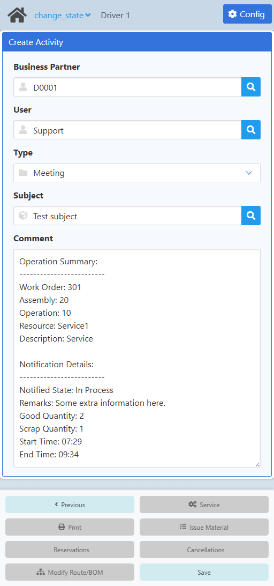

You first need to set the **Business Partner**. Click the <IIcon icon="iconamoon:search-bold" width="17" height="17" /> button on it to open the **Business Partner Search** modal.

<CustomDetails summary="Business Partner Search Modal">

On this screen you need to select one of the **business partners** listed.

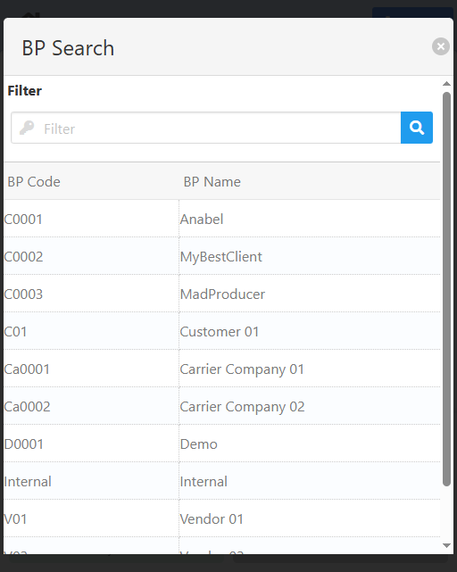

You can select any item by clicking on it, which will close the modal and take you back with that **business partner** already set.

You can filter the list of **business partners** using the search box.

If you want to close the modal without making any changes, click the <IIcon icon="zondicons:close-solid" width="17" height="17"/> button.

</CustomDetails>

Next up is the **User**. Click the <IIcon icon="iconamoon:search-bold" width="17" height="17" /> button on it to open the **User Search** modal.

<CustomDetails summary="User Search Modal">

On this screen you need to select one of the **users** listed.

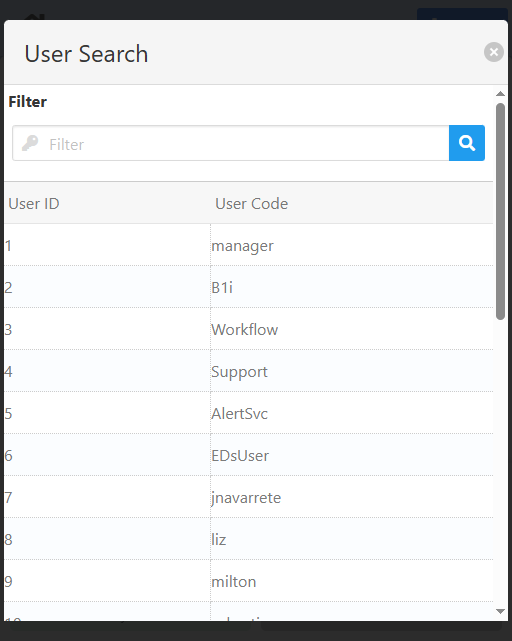

You can select any item by clicking on it, which will close the modal and take you back with that **user** already set.

You can filter the list of **users** using the search box.

If you want to close the modal without making any changes, click the <IIcon icon="zondicons:close-solid" width="17" height="17"/> button.

</CustomDetails>

After that, you need to set the **Type**, which is the **activity type**, using the dropdown menu. 

Continuing, you have the **Subject**. Click the <IIcon icon="iconamoon:search-bold" width="17" height="17" /> button on it to open the **Subject Search** modal.

<CustomDetails summary="Subject Search Modal">

On this screen you need to select one of the **subjects** listed.

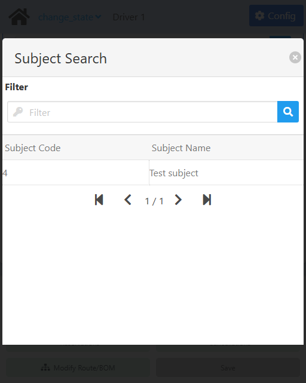

You can select any item by clicking on it, which will close the modal and take you back with that **subject** already set.

You can filter the list of **subjects** using the search box.

If you want to close the modal without making any changes, click the <IIcon icon="zondicons:close-solid" width="17" height="17"/> button.

</CustomDetails>

And  last but not least, you can use the **Comment** field to add extra information on the process.

Once you are done, click **Save** to create the corresponding **activity** and to go back to the [Update Operation](./change_state.md#update-operation) screen for you to continue with the.

## Configuration

:::note[INFO]
Only administrators can access the configuration for a web app.
:::

On this screen you can set the settings that will apply to this web app.

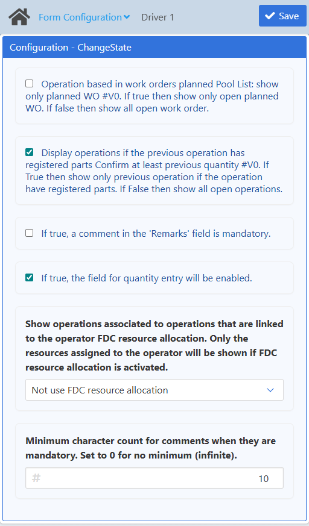

| Name | Description |
| :--- | :--- |
| Operation based in work orders planned | If checked, only planned work orders will be shown in the search results. Otherwise, all open work orders will be shown.    This setting is linked to the **Confirm at least previous quantity** setting in the Configuration Wizard: Production/FDC/Pool report. |
| Display operations if the previous operation has registered parts | If checked, only operations for which its previous operation (in the route) has registered parts will be shown in the search results. Otherwise, all open operation will be shown.    This setting is linked to the **Confirm at least previous quantity** setting in the Configuration Wizard: Production/FDC/Logon/Logoff rules. |
| If true, a comment in the 'Remarks' field is mandatory | If checked, when updating an operation, the remarks will be required. Otherwise, the remarks are optional. |
| If true, the field for quantity entry will be enabled | If checked, the user will have the option of inputting a good and scrap quantities Otherwise, those fields will not be enabled to the user. |
| Show operations associated to operations that are linked to the operator FDC resource allocation | If **Use FDC resource allocation** is selected, only operations that match the type of the ones assigned to the personnel wil be shown in the results. Otherwise, if **Not use FDC resource allocation** is selected, all open operations will be shown in the results to all personnel. |
| Minimum character count for comments when they are mandatory | Defines the minimum number of characters for remarks. If set to 0, no minimum is required (but **If true, a comment in the 'Remarks' field is mandatory** has precedence). |