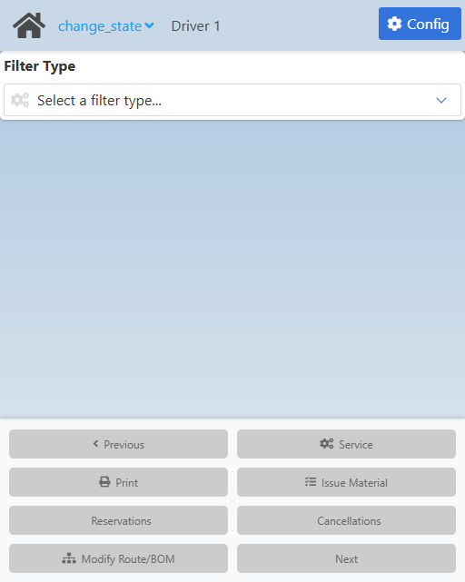
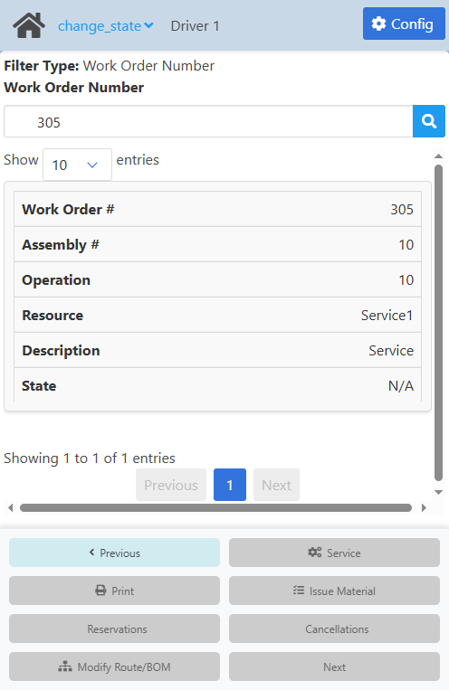
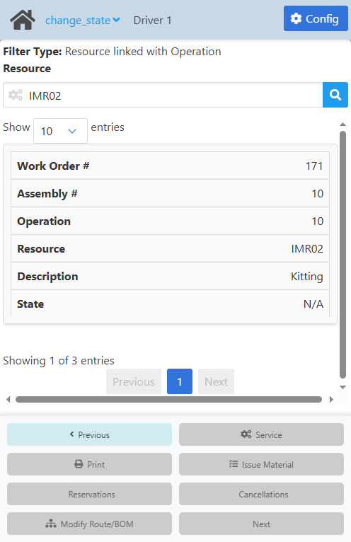
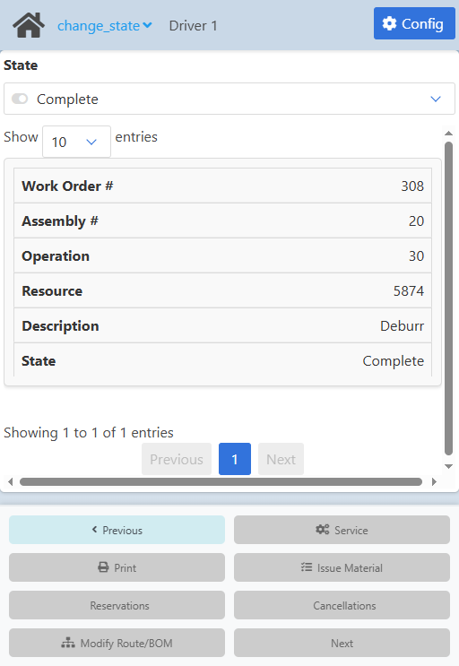
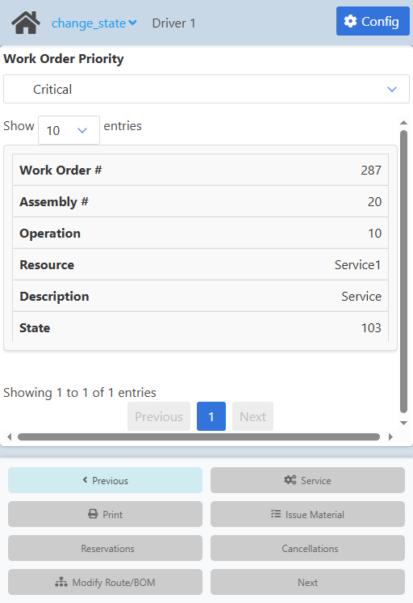
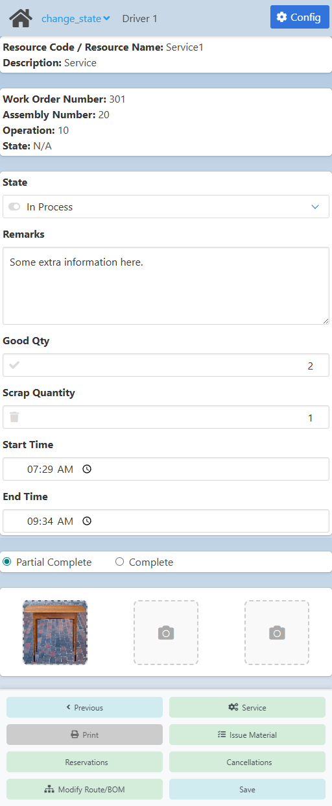

import CustomDetails from "@site/src/components/CustomDetails";
import Tabs from '@theme/Tabs';
import TabItem from '@theme/TabItem';

# Change Operation State

Update the status of operations (completed, on hold, etc...)

## Flow Diagram

## Screens

### Filter Selection

On this screen you can select the type of filter you want to use to find the operation you need to update.

Use the **Filter Type** field to select they way you want to search for operations. 

You can search by:

1. Operation barcode.
2. Work order number.
3. Resource linked to the operation.
4. Operation status.
5. Work order priority.

Once you select one, you will be taken to the [Operations Listing](./change_state.md#list-of-operations) screen.

### List of Operations

On this screen you can see the list of operations that match the filter and the query you used.

<Tabs>
  <TabItem value="barcode" label="Barcode" default>
    
  </TabItem>
  <TabItem value="wo" label="WO">
    
  </TabItem>
  <TabItem value="resource" label="Resource">
    
  </TabItem>
  <TabItem value="state" label="State">
    
  </TabItem>
  <TabItem value="priority" label="Priority">
    
  </TabItem>
  <TabItem value="isntruction" label="Instruction">
    
  </TabItem>
</Tabs>

<CustomDetails summary="Table Reference">
  | Column | Description |
  | --- | --- |
  | Work order number | Work order number. |
  | Assembly number | Work order position. |
  | Operation | Operation. |
  | Resource code / Resource name | Linked resource. |
  | BEZ | Operation instruction. |
  | State | Work order status. |
</CustomDetails>

Use the search box at the top to search using the filter you selected. You can either press enter, click the <IIcon icon="iconamoon:search-bold" width="17" height="17" /> button or just click outside to make the search.

All the operations that match your filter and query will be listed on table below.

You can increase/decrease the number of operations shown on screen at a time using the **Show __ entries** field on top of the table.

You can reorder the table by column as you prefer by clicking on any of its headings.

Click on the operation you want to udpate to go to the [Update Operation](./change_state.md#update-operation) screen.

### Update Operation

On this screen you can update the status of the operation you selected, among other things.

You have 4 sections.

The first one tells you the filter and query you used to find the operation you are updating.

The second one gives you a summary of the operation you are updating.

The third one has more stuff. You can set the **state** of the operation using the **State** field.

You can leave comments using the **Remarks** field.

:::note[INFO]
The **Remarks** field will be affected by the **If true, a comment in the 'Remarks' field is mandatory** setting in the [Configuration](./change_state.md#configuration).
:::

You can set the **Good Qty** and **Scrap Quantity** fields as well using the respective fields.

:::note[INFO]
The **Good Quantity** and **Scrap Quantity** fields will be affected by the **If true, the field for quantity entry will be enabled** setting in the [Configuration](./change_state.md#configuration).
:::

On the fourth section you have the option of attaching up to 3 pictures to the operation. Click on any of the **IMG** buttons and select a picture from your computer.

Once you are done, click **Next** at the bottom to go to the [Update Confirmation](./change_state.md#update-confirmation) screen.

### Update Confirmation

TODO.

### Configuration

:::note[INFO]
Only administrators can access the configuration for a web app.
:::

On this screen you can set the settings that will apply to this web app.

| Name | Description |
| :--- | :--- |
| Operation based in work orders planned | If checked, only planned work orders will be shown in the search results. Otherwise, all open work orders will be shown.    This setting is linked to the **Confirm at least previous quantity** setting in the Configuration Wizard: Production/FDC/Pool report. |
| Display operations if the previous operation has registered parts | If checked, only operations for which its previous operation (in the route) has registered parts will be shown in the search results. Otherwise, all open operation will be shown.    This setting is linked to the **Confirm at least previous quantity** setting in the Configuration Wizard: Production/FDC/Logon/Logoff rules. |
| If true, a comment in the 'Remarks' field is mandatory | If checked, when updating an operation, the remarks will be required. Otherwise, the remarks are optional. |
| If true, the field for quantity entry will be enabled | If checked, the user will have the option of inputting a good and scrap quantityies Otherwise, those fields will not be enabled to the user. |
| Show operations associated to operations that are linked to the operator FDC resource allocation | If **Use FDC resource allocation** is sellected, only operations that match the type of the ones assigned to the personnel wil be shown in the results. Otherwise, if **Not use FDC resource allocation** is sellected, all open operations will be shown in the results to all personnel. |
| Defines the default resource type for operations | Defines the default resource type for operations. |
| Minimum character count for comments when they are mandatory | Defines the minimum number of characters for remarks. If set to 0, no minimum is required. |