import CustomDetails from "@site/src/components/CustomDetails";
import Tabs from '@theme/Tabs';
import TabItem from '@theme/TabItem';

# Modify Route/BoM

Add/Delete routes and BoMs to/from your work orders.

## Flow Diagram

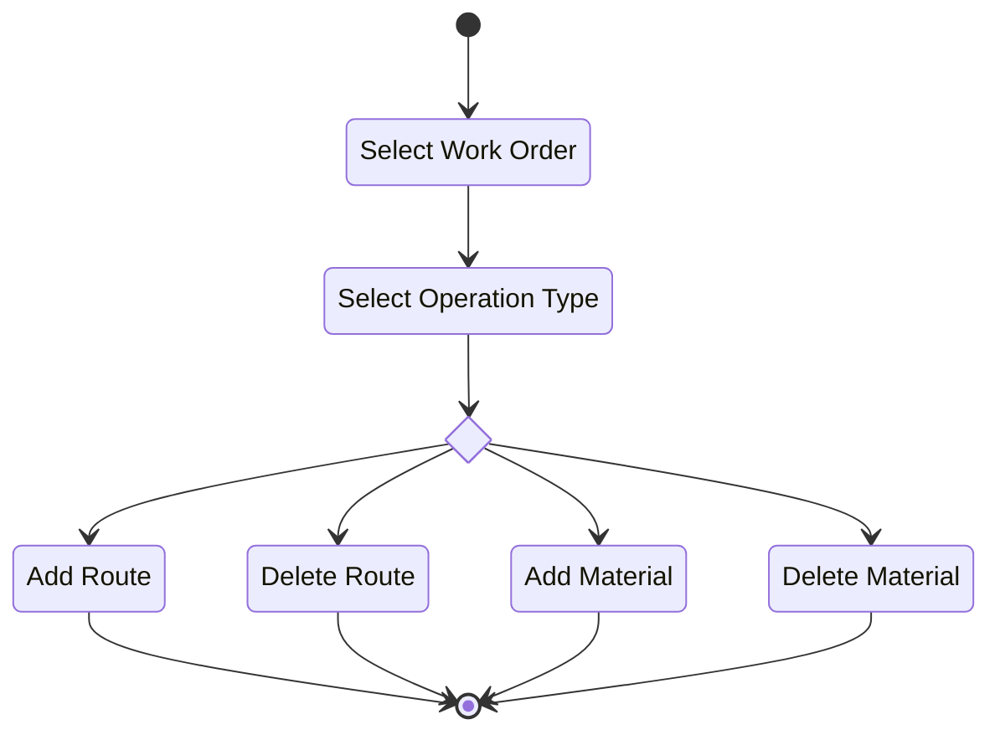

## Screens

### Work Order Assembly Selection

On this screen you need to select the **work order position/assembly** you want add/delete routes and BoMs to/from.

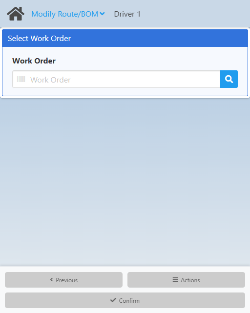

Type in the assembly barcode or click the <IIcon icon='iconamoon:search-bold' width='17' height='17' /> button to open the **Work Order Assembly Search** modal.

<CustomDetails summary='Work Order Assembly Search Modal'>

On this modal you need to select one of the **work order assemblies** listed.

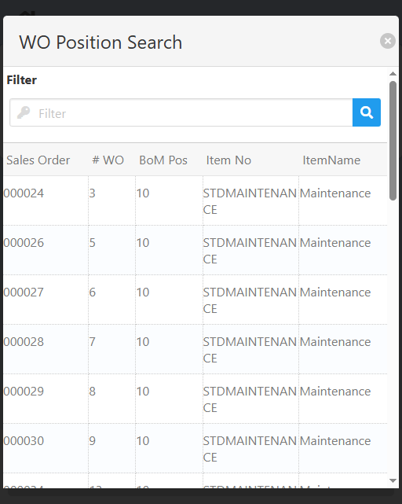

You can select any item by clicking on it, which will close the modal and take you to the [Operation Type Selection](./modify-route-bom.md#operation-type-selection) screen with that **work order assembly** already set.

You can filter the list of **work order assemblies** using the search box.

If you want to close the modal without making any changes, click the <IIcon icon='zondicons:close-solid' width='17' height='17'/> button.

</CustomDetails>

Once you select a work order, you will be taken to the [Operation Type Selection](./modify-route-bom.md#operation-type-selection) screen.

### Operation Type Selection

On this screen you need to select the action you want to perform on the work order.

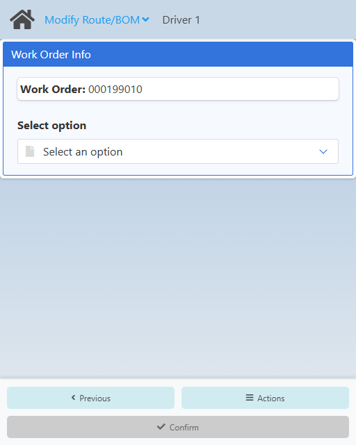

Use the **Select option** dropdown and select one of the actions:

- Add Route.
- Delete Route.
- Add Material.
- Delete Material.

<CustomDetails summary='Operation Type Dropdown'>

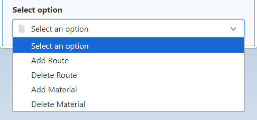

</CustomDetails>

After you select an action, you will be taken to the respective screen:

- [Add Route](./modify-route-bom.md#add-route) screen.
- [Delete Route](./modify-route-bom.md#delete-route) screen.
- [Add Material](./modify-route-bom.md#add-material) screen.
- [Delete Material](./modify-route-bom.md#delete-material) screen.

### Add Route

On this screen you can create a route.

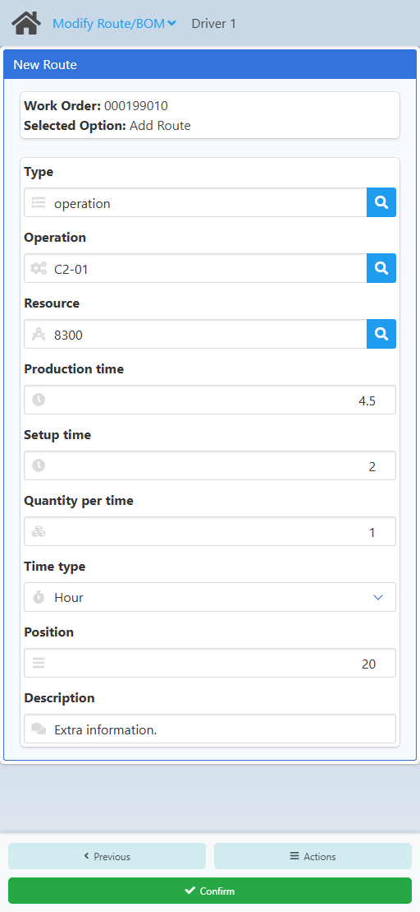

<CustomDetails summary="Mandatory/Optional Fields">
  | Column | Mandatory |
  | --- | --- |
  | Type | Yes |
  | Operation | Yes |
  | Resource | Yes |
  | Production time | Yes |
  | Setup time | Yes |
  | Quantity per time | Yes |
  | Time type | Yes |
  | Position | Yes |
  | Description | No |
</CustomDetails>

Type in the route (**Type**) type or click the <IIcon icon='iconamoon:search-bold' width='17' height='17' /> button to open the **Route Type Search** modal.

<CustomDetails summary='Route Type Search Modal'>

On this modal you need to select one of the **route types** listed.

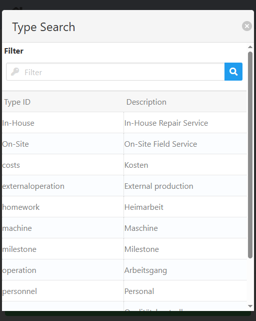

You can select any item by clicking on it, which will close the modal and take you back with that **route type** already set.

You can filter the list of **route types** using the search box.

If you want to close the modal without making any changes, click the <IIcon icon='zondicons:close-solid' width='17' height='17'/> button.

</CustomDetails>

Type in the operation (**Operation**) or click the <IIcon icon='iconamoon:search-bold' width='17' height='17' /> button to open the **Operation Search** modal.

<CustomDetails summary='Operation Search Modal'>

On this modal you need to select one of the **operations** listed.

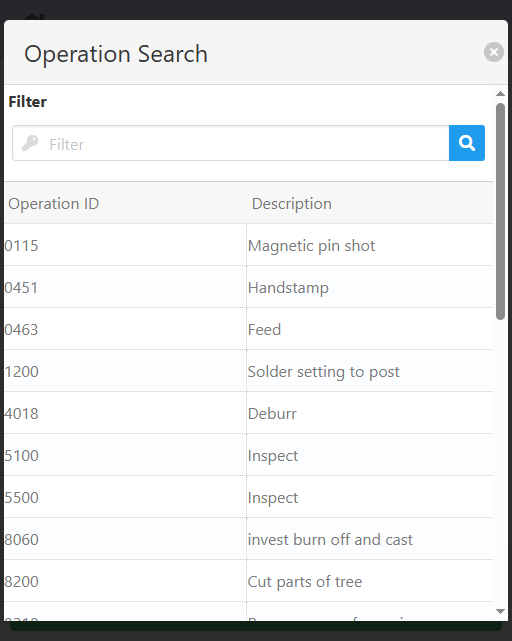

You can select any item by clicking on it, which will close the modal and take you back with that **operation** already set.

You can filter the list of **operations** using the search box.

If you want to close the modal without making any changes, click the <IIcon icon='zondicons:close-solid' width='17' height='17'/> button.

</CustomDetails>

Type in the resource (**Resource**) or click the <IIcon icon='iconamoon:search-bold' width='17' height='17' /> button to open the **Resource Search** modal.

<CustomDetails summary='Resource Search Modal'>

On this modal you need to select one of the **resources** listed.

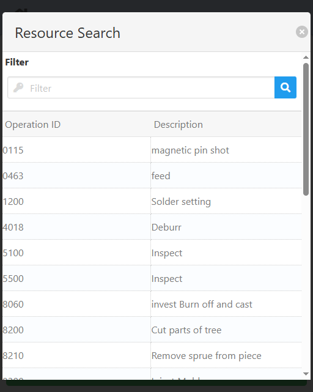

You can select any item by clicking on it, which will close the modal and take you back with that **resource** already set.

You can filter the list of **resources** using the search box.

If you want to close the modal without making any changes, click the <IIcon icon='zondicons:close-solid' width='17' height='17'/> button.

</CustomDetails>

Set the **Production time** to the total time that will be allocated to the operation.

Set the **Setup time** to the time that will be used for setting everything up before starting production.

Set the **Quantity per time** to the amount that will be produced in the total production time above.

Set the **Time type** to the type of time you are using: minutes or hours. This goes in hand with the times set above.

Set the **Position** following the numbering system for routing positions at your company. By default, it will be the number that follows after the previous route position, i.e., 20, if the previous route position is 10.

Set the **Description** to perhaps another name for the routing position, but it can be anything.

Once you are done, click **Confirm** at the bottom and confirm in the modal to **create** the new routing position and to go back to: 

- The [Home](./modify-route-bom.md#work-order-assembly-selection) screen, if you are using this web app as a standalone.
- The [Operation Type Selection](./modify-route-bom.md#operation-type-selection) screen, if you came from the main **APDC** web app.

### Delete Route

On this screen you can delete routing positions.

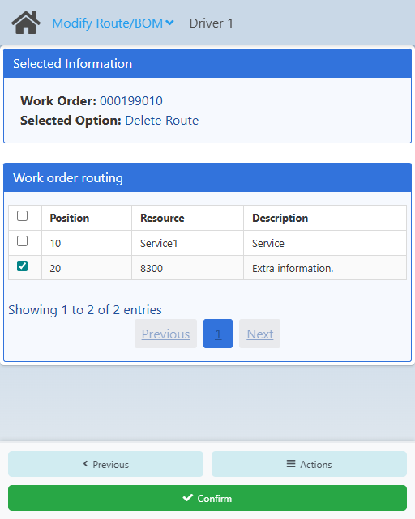

<CustomDetails summary="Table Reference">
  | Column | Description |
  | --- | --- |
  | <IIcon icon='line-md:square' width='17' height='17'/> | Action button for selecting operations/routes for deletion. |
  | Position | Operation/Route position. |
  | Resource | Operation/Route resource. |
  | Description | Operation/Route description. |
</CustomDetails>

Select the routing position(s) that you want to delete from the work order assembly by clicking the <IIcon icon='line-md:square' width='17' height='17'/> button in the leftmost column.

Once you are done, click **Confirm** at the bottom and confirm in the modal to **delete** the routing position(s) and to go back to: 

- The [Home](./modify-route-bom.md#work-order-assembly-selection) screen, if you are using this web app as a standalone.
- The [Operation Type Selection](./modify-route-bom.md#operation-type-selection) screen, if you came from the main **APDC** web app.

### Add Material

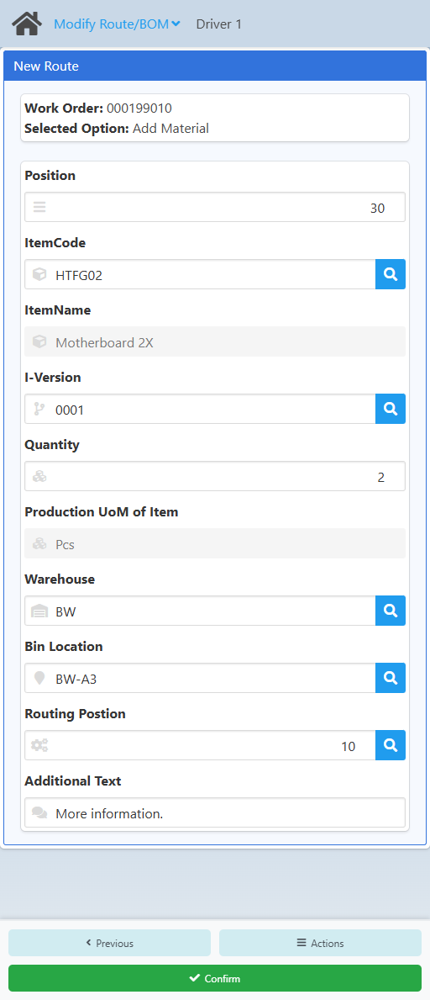

<CustomDetails summary="Mandatory/Optional Fields">
  | Column | Mandatory |
  | --- | --- |
  | Position | Yes |
  | ItemCode | Yes |
  | ItemName | No |
  | I-Version | No |
  | Quantity | Yes |
  | Production UoM of Item | No |
  | Warehouse | Yes |
  | Bin Location | No |
  | Routing Postion | No |
  | Additional Text | No |
</CustomDetails>

Set the **Position** following the numbering system for BoM positions at your company. By default, it will be the number that follows after the previous BoM position, i.e., 30, if the previous BoM position is 20.

Type in the item (**ItemCode**) or click the <IIcon icon='iconamoon:search-bold' width='17' height='17' /> button to open the **Item Search** modal.

<CustomDetails summary='Item Search Modal'>

On this modal you need to select one of the **items** listed.

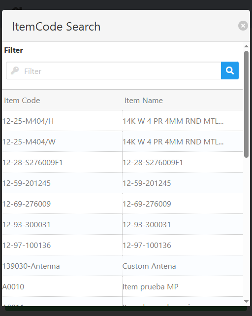

You can select any item by clicking on it, which will close the modal and take you back with that **item** already set.

You can filter the list of **items** using the search box.

If you want to close the modal without making any changes, click the <IIcon icon='zondicons:close-solid' width='17' height='17'/> button.

</CustomDetails>

The **ItemName** is the name of the item and is an informative field.

Type in the version of the item (**I-Version**) or click the <IIcon icon='iconamoon:search-bold' width='17' height='17' /> button to open the **I-Version Search** modal.

<CustomDetails summary='I-Version Search Modal'>

On this modal you need to select one of the **i-versions** listed.

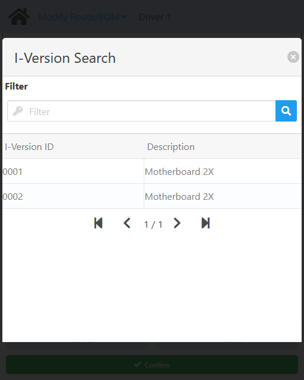

You can select any item by clicking on it, which will close the modal and take you back with that **i-version** already set.

You can filter the list of **i-versions** using the search box.

If you want to close the modal without making any changes, click the <IIcon icon='zondicons:close-solid' width='17' height='17'/> button.

</CustomDetails>

Set the **Quantity** to the amount that is needed of the material.

The **Production UoM of item** is just that and is an informative field. It comes from the master data.

Type in the warehouse (**Warehouse**) or click the <IIcon icon='iconamoon:search-bold' width='17' height='17' /> button to open the **Warehouse Search** modal.

<CustomDetails summary='Warehouse Search Modal'>

On this modal you need to select one of the **warehouses** listed.

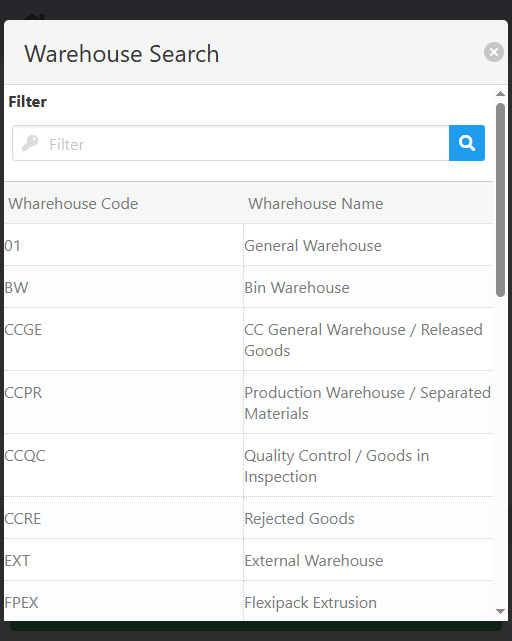

You can select any item by clicking on it, which will close the modal and take you back with that **warehouse** already set.

You can filter the list of **warehouses** using the search box.

If you want to close the modal without making any changes, click the <IIcon icon='zondicons:close-solid' width='17' height='17'/> button.

</CustomDetails>

Type in the bin (**Bin Location**) or click the <IIcon icon='iconamoon:search-bold' width='17' height='17' /> button to open the **Bin Location Search** modal.

<CustomDetails summary='Bin Location Search Modal'>

On this modal you need to select one of the **bin locations** listed.

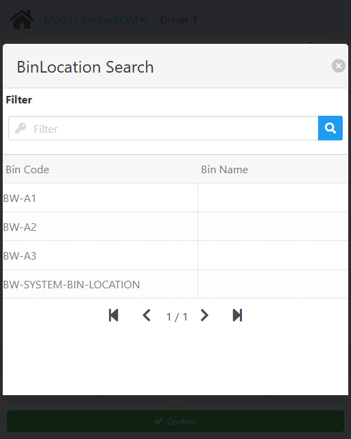

You can select any item by clicking on it, which will close the modal and take you back with that **bin location** already set.

You can filter the list of **bin locations** using the search box.

If you want to close the modal without making any changes, click the <IIcon icon='zondicons:close-solid' width='17' height='17'/> button.

</CustomDetails>

Type in the operation position (**Routing Position**) or click the <IIcon icon='iconamoon:search-bold' width='17' height='17' /> button to open the **Routing Position Search** modal.

<CustomDetails summary='Routing Position Search Modal'>

On this modal you need to select one of the **routing positions** listed.

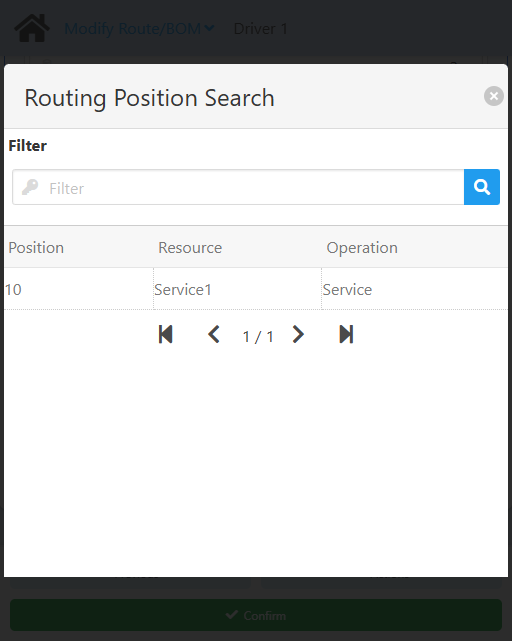

You can select any item by clicking on it, which will close the modal and take you back with that **routing position** already set.

You can filter the list of **routing positions** using the search box.

If you want to close the modal without making any changes, click the <IIcon icon='zondicons:close-solid' width='17' height='17'/> button.

</CustomDetails>

Set the **Additional Text** to some extra information that could be useful for identying the BoM later on.

Once you are done, click **Confirm** at the bottom and confirm in the modal to **create** the BoM and to go back to: 

- The [Home](./modify-route-bom.md#work-order-assembly-selection) screen, if you are using this web app as a standalone.
- The [Operation Type Selection](./modify-route-bom.md#operation-type-selection) screen, if you came from the main **APDC** web app.

### Delete Material

On this screen you can delete BoMs.

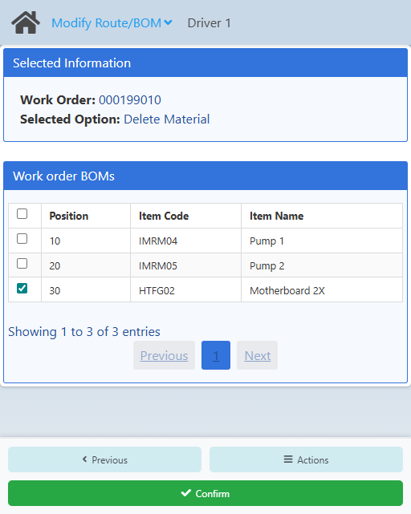

<CustomDetails summary="Table Reference">
  | Column | Description |
  | --- | --- |
  | <IIcon icon='line-md:square' width='17' height='17'/> | Action button for selecting BoMs for deletion. |
  | Position | BoM position. |
  | Item Code | BoM item code. |
  | Item Name | BoM item name. |
</CustomDetails>

Select the BoM(s) that you want to delete from the work order assembly by clicking the <IIcon icon='line-md:square' width='17' height='17'/> button in the leftmost column.

Once you are done, click **Confirm** at the bottom and confirm in the modal to **delete** the BoM(s) and to go back to: 

- The [Home](./modify-route-bom.md#work-order-assembly-selection) screen, if you are using this web app as a standalone.
- The [Operation Type Selection](./modify-route-bom.md#operation-type-selection) screen, if you came from the main **APDC** web app.