import CustomDetails from "@site/src/components/CustomDetails";
import Tabs from '@theme/Tabs';
import TabItem from '@theme/TabItem';

# Reservations

Make reservations of the materials you need for your work orders.

## Flow Diagram

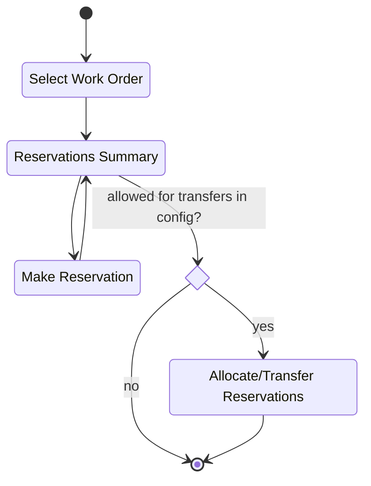

## Screens

### Work Order Selection

On this screen you need to select the **work order position/assembly** you want to make reservations for.

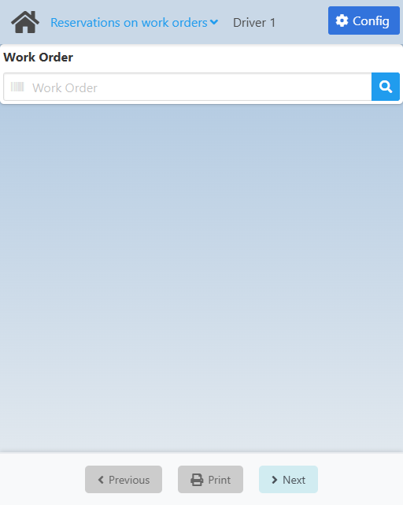

Type in the barcode for the work order assembly or click the <IIcon icon="iconamoon:search-bold" width="17" height="17" /> button to open the **Work Order Position Search** modal.

<CustomDetails summary="Work Order Position Search Modal">

On this modal you need to select one of the **work order positions** listed.

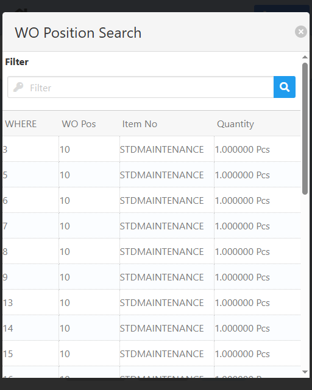

You can select any item by clicking on it, which will close the modal with that **work order position** already set.

You can filter the list of **work order positions** using the search box.

If you want to close the modal without making any changes, click the <IIcon icon="zondicons:close-solid" width="17" height="17"/> button.

</CustomDetails>

Once you input or select a work order position, you will be taken to the [BoM Reservation Summary](./reservations.md#bom-reservation-summary) screen.

### BoM Reservation Summary

On this screen you will see the **list of BoMs** associated with the work order assembly selected, and their current reservations.

<Tabs>
  <TabItem value="collapsed" label="Collapsed" default>
    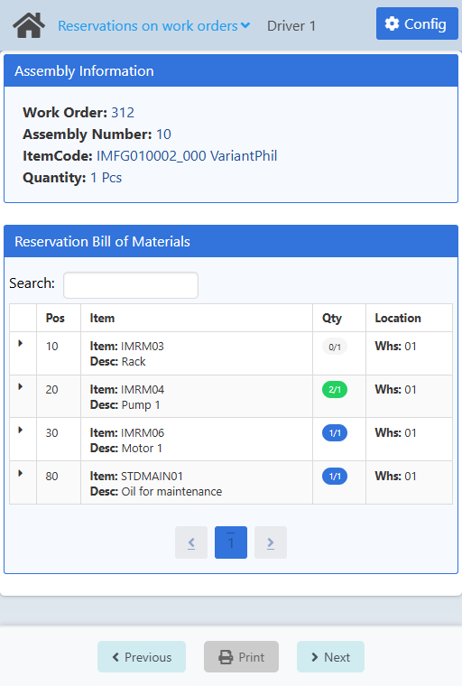
  </TabItem>
  <TabItem value="expanded" label="Expanded">
    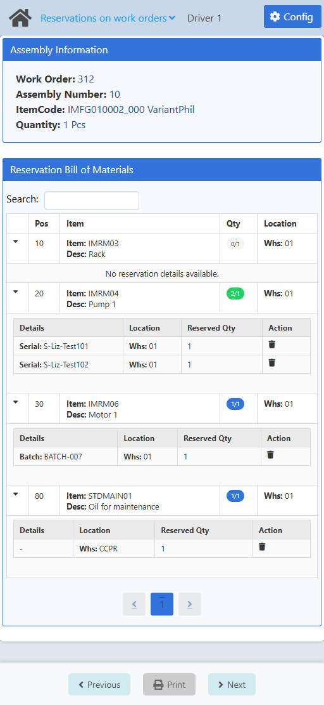
  </TabItem>
</Tabs>

<CustomDetails summary="BoM Table Reference">
  | Column | Description |
  | --- | --- |
  |  | Action button for expanding the row/BoM to see its reservations. |
  | Pos | ID of the BoM. |
  | Item | ID of the item. |
  | Qty | Currently reserved quantity / Planned quantity.    **Gray:** under-reserving.    **Blue:** exact reserve.    **Green:** over-reserving. |
  | Location | Location to take the material from, according to the BoM. |
</CustomDetails>

<CustomDetails summary="Reservation Table Reference">
  | Column | Description |
  | --- | --- |
  | Details | Serial number (Serial), batch (Batch), - (non-managed item). |
  | Location | Location where the item is located. |
  | Reserved Qty | Actual reserved quantity for that batch/serial. |
  | Action | Action button for deleting/cancelling the reservation. |
</CustomDetails>

At the top you will see a summary of what you are working with.

You can **search** for a specific BoM using the search field.

You can **sort** the BoMs by clicking the headers on any of the columns.

If you want to see what reservations are **currently active** on a BoM, click the leftmost column for it to expand the row and see the reservations (see the Expanded tab).

If you want to **delete/cancel** a reservation, expand the BoM row and click the <IIcon icon="ic:baseline-delete" width="17" height="17" /> button on that reservations and confirm.

If you want to make **new reservations** for a BoM, click any of the other columns for it to go to the [Make Reservation](./reservations.md#make-reservation) screen.

Once you have the reservations you need ready, click **Next** to go to the [BOM Allocation](./reservations.md#bom-allocation) screen.

:::note[INFO]
The **Next** button behavior is affected by the **Allows the user to make a reservation transfer** setting in the [Configuration](./reservations.md#configuration).
:::

### Make Reservation

On this screen you make the material reservations by selecting the batch/serial and quantity you need.

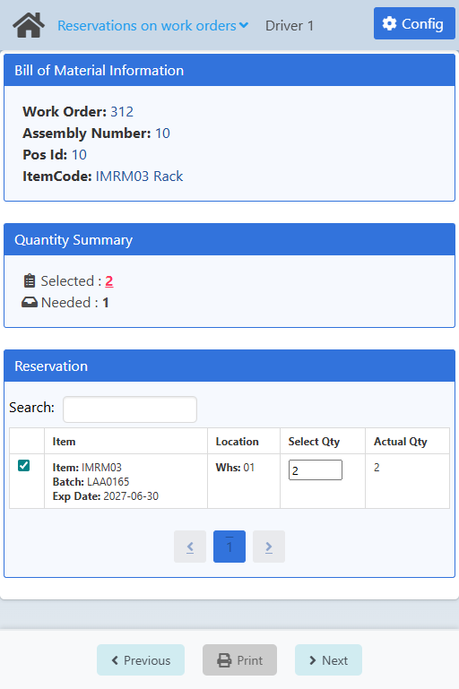

<CustomDetails summary="Table Reference">
  | Column | Description |
  | --- | --- |
  |  | Action button for selecting the item. |
  | Item | ID of the item.    Batch/Serial number.    Expiration date. |
  | Location | Where the item is located. |
  | Select Qty | Quantity that will be reserved. |
  | Actual Qty | Total quantity. |
</CustomDetails>

At the top you will see a summary of what you are working with.

Next, you have the **selected** and **needed** quantities. If the selected quantity is red, it means you are currently over-reserving, but you can still make the reservation.

Then you will see a table with all the items that you can make reservations of.

:::note[INFO]
The locations from where you can make reservations will be defined by the **Issue only from default warehouse / bin location** setting.

**Configuration wizard** > **Production** > **Material posting** > **Backflushing**.
:::

**Filter** the table using the search box above it.

**Sort** the table by column by clicking on its headers.

**Select** the items you want by setting the value of the **Select Qty** field to what you need and clicking the <IIcon icon="line-md:square" width="17" height="17"/> button on the leftmost column.

Once you are done, click **Next** at the bottom to make the reservation in the system and to go back to the [BoM Reservation Summary](./reservations.md#bom-reservation-summary) screen.

### BoM Allocation

On this screen you can **allocate/transfer** the reservations you had before.

<Tabs>
  <TabItem value="collapsed" label="Collapsed" default>
    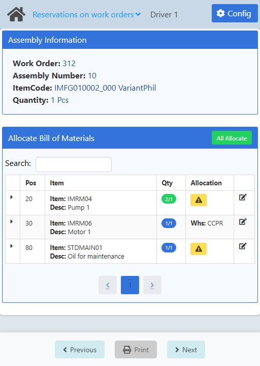
  </TabItem>
  <TabItem value="expanded" label="Expanded">
    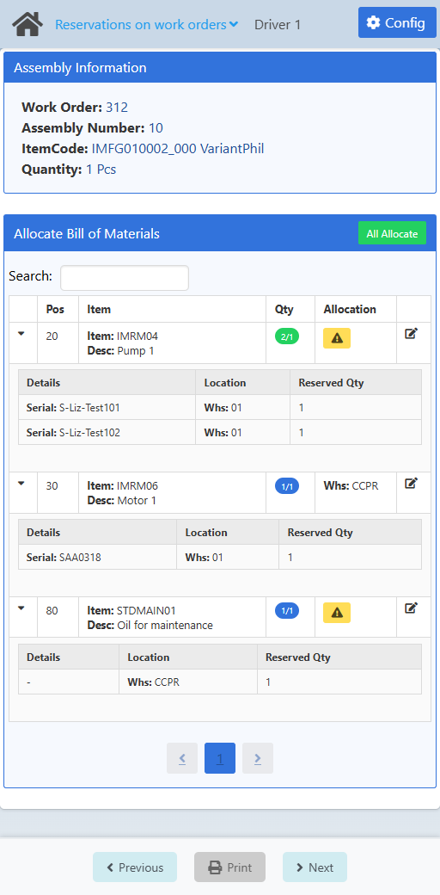
  </TabItem>
</Tabs>

<CustomDetails summary="BoM Table Reference">
  | Column | Description |
  | --- | --- |
  |  | Action button for expanding the row/BoM to see its reservations. |
  | Pos | ID of the BoM. |
  | Item | ID of the item. |
  | Qty | Currently reserved quantity / Planned quantity.    **Gray:** under-reserving.    **Blue:** exact reserve.    **Green:** over-reserving. |
  | Allocation | Location to where the items/reservations will be allocated/transferred. |
  |  | Action button for setting the destination location per item. |
</CustomDetails>

<CustomDetails summary="Reservation Table Reference">
  | Column | Description |
  | --- | --- |
  | Details | Serial number (Serial), batch (Batch), - (non-managed item). |
  | Location | Location where the item is located. |
  | Reserved Qty | Actual reserved quantity for that batch/serial. |
</CustomDetails>

At the top you can see a summary of what you are working with.

Next, you have a table with all the reservations that will be allocated/transferred if you choose to do so.

You can **search** for a specific BoM using the search field.

You can **sort** the BoMs by clicking the headers on any of the columns.

If you want to see the reservations per BoM that you will be allocating/transferring, click the leftmost column for it to expand the row and see the reservations (see the Expanded tab).

You can set the location to where a reservation will be allocated/transferred by clicking the button on the rightmost column to open the **Select Allocation Search** modal and set it for that individual BoM.

<CustomDetails summary="Select Allocation Search Modal">

On this modal you need to select a warehouse and bin location (if applicable).

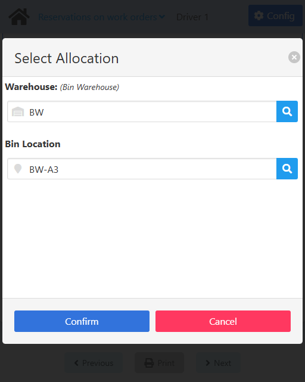

Click the <IIcon icon="iconamoon:search-bold" width="17" height="17" /> button on the **Warehouse** field to open the **Warehouse Search** modal.

<CustomDetails summary="Warehouse Search Modal">

On this screen you need to select one of the **warehouses** listed.

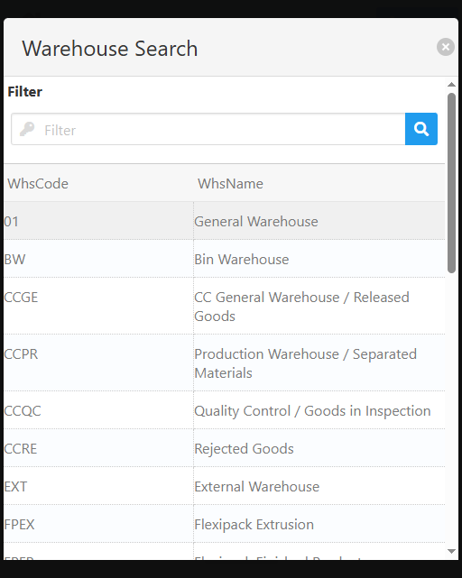

You can select any item by clicking on it, which will close the modal with that **warehouse** already set.

You can filter the list of **warehouses** using the search box.

If you want to close the modal without making any changes, click the <IIcon icon="zondicons:close-solid" width="17" height="17"/> button.

</CustomDetails>

If the warehouse is managed by a bin, click the <IIcon icon="iconamoon:search-bold" width="17" height="17" /> button on the **Bin Location** field to open the **Bin Location Search** modal.

<CustomDetails summary="Bin Location Search Modal">

On this screen you need to select one of the **bin locations** listed.

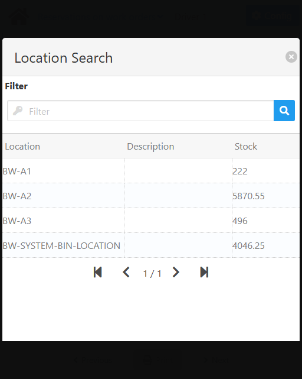

You can select any item by clicking on it, which will close the modal with that **bin location** already set.

You can filter the list of **bin locations** using the search box.

If you want to close the modal without making any changes, click the <IIcon icon="zondicons:close-solid" width="17" height="17"/> button.

</CustomDetails>

If you want to close the modal without making any changes, click the <IIcon icon="zondicons:close-solid" width="17" height="17"/> or **Cancel** buttons.

If you are done, click **Confirm** to save the changes and to close the modal.

</CustomDetails>

Or if you want, you can set the same location for all BoMs at the same time by clicking the **All Allocate** button to open the **Search Allocation Search** modal.

<CustomDetails summary="Select Allocation Search Modal">

On this modal you need to select a warehouse and bin location (if applicable).

Click the <IIcon icon="iconamoon:search-bold" width="17" height="17" /> button on the **Warehouse** field to open the **Warehouse Search** modal.

<CustomDetails summary="Warehouse Search Modal">

On this screen you need to select one of the **warehouses** listed.

You can select any item by clicking on it, which will close the modal with that **warehouse** already set.

You can filter the list of **warehouses** using the search box.

If you want to close the modal without making any changes, click the <IIcon icon="zondicons:close-solid" width="17" height="17"/> button.

</CustomDetails>

If the warehouse is managed by a bin, click the <IIcon icon="iconamoon:search-bold" width="17" height="17" /> button on the **Bin Location** field to open the **Bin Location Search** modal.

<CustomDetails summary="Bin Location Search Modal">

On this screen you need to select one of the **bin locations** listed.

You can select any item by clicking on it, which will close the modal with that **bin location** already set.

You can filter the list of **bin locations** using the search box.

If you want to close the modal without making any changes, click the <IIcon icon="zondicons:close-solid" width="17" height="17"/> button.

</CustomDetails>

If you want to close the modal without making any changes, click the <IIcon icon="zondicons:close-solid" width="17" height="17"/> or **Cancel** buttons.

If you are done, click **Confirm** to save the changes and to close the modal.

</CustomDetails>

Once you are done, click **Next** at the bottom to execute an **inventory transfer** (take note of the information and click Ok) and to go to the [Home](./reservations.md#work-order-selection) screen to start a new reservation process.

## Configuration

:::note[INFO]
Only administrators can access the configuration for a web app.
:::

On this screen you can set the settings that will apply to this web app.

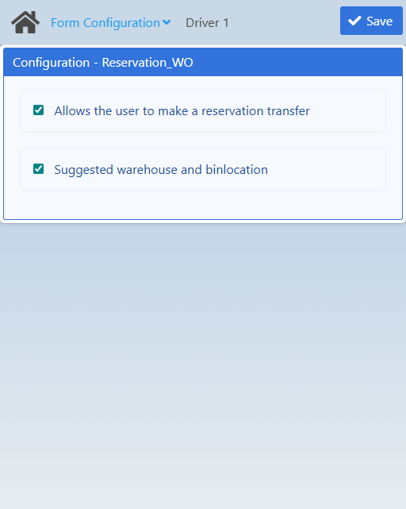

| Name | Description |
| :--- | :--- |
| Allows the user to make a reservation transfer | If checked, the [BoM Allocation](./reservations.md#bom-allocation) screen will not be available to the user to transfer reservations. Otherwise, said screen will not be shown and the user will be taken to the home screen instead. |
| Suggested warehouse and binlocation | If checked, on the [BoM Allocation](./reservations.md#bom-allocation) screen the location by default for allocations will be the one in the BOM. Otherwise, no location will be suggested and thus the user will have to choose manually. |